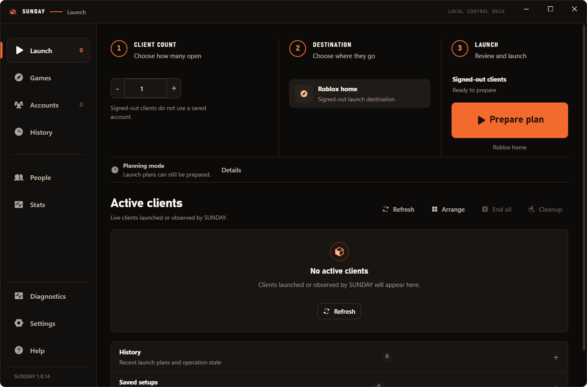

# SUNDAY

### A Roblox account manager and multi-instance launcher for Windows.

SUNDAY lets you manage multiple Roblox accounts, sign in, and launch up to six
managed Roblox clients from one desktop app.

**One app. Multiple accounts. Multiple Roblox clients.**

[Download](https://github.com/SadinKai/SUNDAY/releases) ·
[Documentation](docs/README.md) ·
[Privacy](PRIVACY.md) ·
[Report a bug](https://github.com/SadinKai/SUNDAY/issues/new?template=bug_report.yml)



> Multi-instance launching uses SUNDAY's default-on legacy compatibility path.
> You can disable it in Settings.
> SUNDAY is an independent project and is not affiliated with or endorsed by
> Roblox Corporation.

## What you can do

- **Manage multiple accounts** in one place.
- **Sign in and switch accounts** without juggling browser profiles.
- **Choose a game or destination** from SUNDAY.
- **Launch up to six Roblox clients** through the legacy compatibility mode.
- **See, focus, restart, or stop active clients** from one dashboard.
- **Browse Roblox games and players** without leaving the app.

## Install SUNDAY

1. Open [GitHub Releases](https://github.com/SadinKai/SUNDAY/releases).
2. Download `SundayInstaller.exe` from the latest release.
3. Run the installer, then open **SUNDAY**.

The v1.8.18 Windows binaries are unsigned, so Windows SmartScreen may show a
warning. The portable `SundayPortable_1.8.18_x64.zip` is available on
the same release page. SUNDAY supports Windows 10 or later on x64 and requires
Microsoft WebView2 Runtime.

## Add an account and launch

1. Open **Accounts** and choose **Add account**.
2. Sign in through the temporary Roblox window.
3. Return to **Launch** and select one account.
4. Choose a destination, review the launch, and select **Launch**.
5. Use **Active clients** to focus, restart, or stop clients SUNDAY launched.

Account metadata stays local. Roblox session material is protected for the
current Windows user with Windows DPAPI and is not exposed in ordinary renderer
state. Read [Privacy](PRIVACY.md) for the complete current behavior.

## Multi-instance mode

Multi-instance mode is enabled by default on a fresh installation and uses
SUNDAY's existing legacy Roblox compatibility adapter. No environment variable,
PowerShell command, or manual activation is required.

Existing users keep an explicit saved choice. Turning the setting on or off
requires saving and accepting a visible restart prompt; SUNDAY never forces the
restart. The exact `LEGACY_COMPAT=1` environment value remains only as a
backward-compatible developer override.

Turning the setting off and restarting selects an unavailable adapter, so
SUNDAY will still plan launches but will not start Roblox. See
[Multi-instance mode](docs/user/multi-instance.md) for limitations and recovery
steps.

SUNDAY automatically discovers verified classic Roblox installations from
bounded Windows locations, registered Roblox protocol handlers, and running
process evidence. It also detects Microsoft Store / AppX Roblox dynamically
from package metadata. Store Roblox is reported clearly, but it is not eligible
for SUNDAY's file-cloning legacy multi-instance path; install classic Roblox
from roblox.com to use Multi-instance mode.

## Troubleshooting

- **A launch fails:** retry once, then open Diagnostics and use **Copy
  sanitized launch diagnostics**. SUNDAY never adopts an existing Roblox
  client, so close an unrelated client before retrying.
- **Roblox is not detected:** use **Re-detect** in Settings, then choose a
  verified installation or select the classic `RobloxPlayerBeta.exe` manually.
- **Microsoft Store Roblox is detected:** install the standard Windows client
  from roblox.com before using Multi-instance mode.
- **A session expired:** open Accounts and choose **Sign in again**.
- **SmartScreen appears:** v1.8.18 is intentionally unsigned. Verify the file
  came from the canonical Releases page and compare its published SHA-256 hash.

See [Troubleshooting](docs/user/troubleshooting.md) for more help.

## Project status

[](https://github.com/SadinKai/SUNDAY/actions/workflows/ci.yml)


[](LICENSE)

Roblox compatibility can change outside this project's control. The legacy
path is bounded to six managed clients and is not vendor-supported isolation or
a performance guarantee. Use only accounts, installations, and processes you
own or are authorized to operate.

## Documentation

The [documentation index](docs/README.md) separates user guidance from
developer and release-engineering material.

For users:

- [Getting started](docs/user/getting-started.md)
- [Accounts and sign-in](docs/user/accounts.md)
- [Multi-instance mode](docs/user/multi-instance.md)
- [Troubleshooting](docs/user/troubleshooting.md)
- [Privacy](PRIVACY.md) and [Support](SUPPORT.md)

For contributors:

- [Architecture](docs/developer/architecture.md)
- [Development](docs/developer/development.md)
- [Testing and evidence levels](docs/developer/testing.md)
- [Legacy compatibility boundary](docs/developer/legacy-compatibility.md)
- [Release engineering](docs/developer/release.md)
- [Contributing](CONTRIBUTING.md) and [Security policy](SECURITY.md)

## Build from source

SUNDAY uses Node.js 22.23.x, Rust 1.96.0 with the MSVC toolchain, the Windows
SDK, Visual Studio C++ Build Tools, and WebView2. Lockfiles are authoritative.

```powershell
git clone https://github.com/SadinKai/SUNDAY.git
cd SUNDAY
npm ci
npm test
npm run start
```

The default adapter is the bounded legacy compatibility adapter for up to six
clients. An explicit saved opt-out selects the unavailable planning-only
adapter. Build, packaging, installer, and qualification commands are
documented in [Development](docs/developer/development.md) and
[Testing](docs/developer/testing.md).

## Security model

- Destructive process actions require a current opaque capability tied to
  process creation identity and canonical executable path; PID alone is not
  authorization.
- SUNDAY never adopts a Roblox client it did not launch.
- Session material is DPAPI-protected and temporary sign-in profiles are
  purged.
- Network and installer inputs are bounded and validated.
- Automatic updater installation is not active in v1.8.18. **View releases**
  opens the canonical GitHub page for a manual download.

These controls reduce specific risks; they do not make the host or an account
invulnerable. Report vulnerabilities privately as described in
[SECURITY.md](SECURITY.md).

## Origin and Attribution

SUNDAY Launcher originated from the open-source
[Fleet project](https://github.com/Toluwer/Fleet), published by the GitHub
account **Toluwer**. The upstream package metadata identifies the author as
**Toluwa** and declares Fleet MIT-licensed. This documentation does not assert
that Toluwa and Toluwer are the same person.

SUNDAY has since undergone substantial independent development under the
SUNDAY project by SADINKAI, including architecture, security hardening,
compatibility, UI/UX, packaging, testing, and release tooling. SUNDAY is not an
official Fleet successor and no upstream endorsement is implied. See
[NOTICE.md](NOTICE.md) for the concise provenance record.

## License

SUNDAY modifications are distributed under the [MIT License](LICENSE).
Inherited Fleet provenance and its declared MIT status are recorded in
[NOTICE.md](NOTICE.md). The bundled Phosphor icon subset is covered by
[PHOSPHOR_LICENSE.txt](PHOSPHOR_LICENSE.txt). See [CHANGELOG.md](CHANGELOG.md)
for release history.
