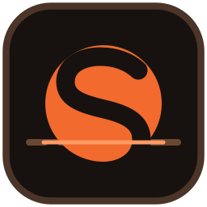
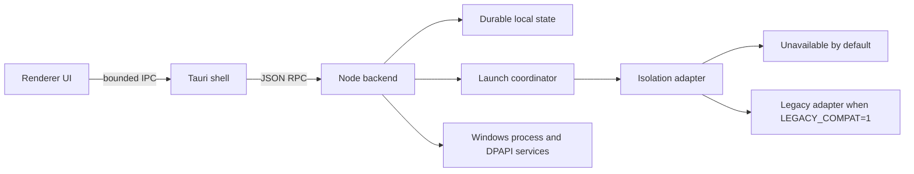

<p align="center">
  
</p>

# SUNDAY Launcher

[](https://github.com/SadinKai/SUNDAY/actions/workflows/ci.yml)


[](LICENSE)

SUNDAY Launcher is a Windows desktop launcher for managing Roblox accounts,
sessions, and explicitly enabled multi-instance workflows.

SUNDAY is an independent project maintained by **SADINKAI**. It is not affiliated
with or endorsed by Roblox Corporation.

## What SUNDAY does

| Area | Capability |
| --- | --- |
| Accounts | Stores account metadata locally and protects active Roblox sessions with Windows DPAPI. |
| Discovery | Browses bounded Roblox game, server, people, and presence data. |
| Processes | Observes clients and authorizes focus, stop, and restart through opaque process capabilities. |
| Coordination | Maintains one authoritative desktop instance and durable launch-plan state. |
| Compatibility | Offers an explicit, disabled-by-default legacy path for up to three client slots. |
| Distribution | Builds a portable application plus a fail-closed standalone installer and release manifest. |

## Supported platform

- Windows 10 or later, x64
- Microsoft WebView2 Runtime
- Roblox desktop client, when Roblox workflows are used

macOS and Linux are not supported. Roblox compatibility can change outside this
project's control; this repository does not claim vendor-supported isolation.

## Requirements

- Node.js 22.23.x
- Rust 1.96.0 with `x86_64-pc-windows-msvc`, `rustfmt`, and `clippy`
- Visual Studio C++ Build Tools and a Windows SDK
- PowerShell 7 or Windows PowerShell 5.1

The committed npm and Cargo lockfiles are the dependency source of truth.

## Quick start

```powershell
git clone https://github.com/SadinKai/SUNDAY.git
cd SUNDAY
npm ci
npm test
npm run start
```

Development startup does not enable Roblox execution automatically. See
[Getting started](docs/getting-started.md) and
[Development](docs/development.md) before enabling native or live tests.

## Runtime modes

The default adapter is `UnavailableRobloxIsolationAdapter`. It preserves launch
planning while refusing to spawn Roblox.

`LEGACY_COMPAT=1` must be inherited by the SUNDAY process to select
`LegacyRobloxIsolationAdapter`. The UI then displays **LEGACY MULTI-INSTANCE
MODE**. Values such as `true`, `yes`, or `0` do not enable it.

```powershell
$env:LEGACY_COMPAT = '1'
npm run start
```

Legacy mode is an unsupported compatibility mechanism, not a general security
boundary or a claim of official multi-instance support. Use only accounts,
installations, and processes you are authorized to operate. Read
[Compatibility](docs/compatibility.md) for the exact boundary.

## Development, build, and test

```powershell
npm ci
npm test
npm audit --omit=dev --audit-level=moderate

cargo check --locked --manifest-path src-tauri/Cargo.toml
cargo clippy --locked --manifest-path src-tauri/Cargo.toml --all-targets --all-features -- -D warnings
cargo test --locked --manifest-path src-tauri/Cargo.toml --all-features

cargo check --locked --manifest-path installer/Cargo.toml
cargo clippy --locked --manifest-path installer/Cargo.toml --all-targets --all-features -- -D warnings
cargo test --locked --manifest-path installer/Cargo.toml

cargo audit --file src-tauri/Cargo.lock
cargo audit --file installer/Cargo.lock

npm run dist
npm run release:package
npm run audit:artifacts
```

`npm run dist` produces `dist/Sunday/Sunday.exe`,
`dist/SundayInstaller.exe`, and `dist/SundayUninstall.exe`.
`npm run release:package` adds the portable archive and release inventory needed
by the artifact audit. Generated output is ignored and must not be committed.
Unsigned development artifacts are not production releases.

See [Testing](docs/testing.md) for automated, isolated-VM, packaging, and
optional live-test boundaries. See [Release engineering](docs/release.md) for
the signing and manifest workflow.

## Architecture



The process capability model separates observation from ownership. Numeric PIDs
alone never authorize destructive actions. The complete component and trust
boundary description is in [Architecture](docs/architecture.md).

## Accounts and sessions

Account metadata is local. Active session material is protected with Windows
DPAPI for the current Windows user. Sign-in uses an origin-restricted temporary
WebView profile, which is purged after completion. Never place cookies, account
records, runtime databases, or diagnostic exports in issues or commits.

## Security model and limitations

- Roblox execution is unavailable by default.
- Process actions require a current capability bound to creation identity and
  canonical executable path.
- HTTP requests use centralized HTTPS, host, redirect, media-type, timeout, and
  response-size policies.
- The installer accepts a fresh dedicated destination and applies archive and
  reparse-point checks.
- Release signing is fail-closed when production signing is required.
- The in-application updater remains unavailable until its complete trust chain
  is qualified.

These controls reduce specific risks; they do not make the application, host,
or Roblox account invulnerable. Review [SECURITY.md](SECURITY.md) before
reporting a vulnerability.

## Migration support

The SUNDAY identity is canonical: `Sunday.exe` and
`com.sadinkai.sundaylauncher`. Narrow compatibility modules import supported
state and installer ownership records from the former product identity without
making that identity current. See [Migration](docs/migration.md).

## Troubleshooting

- **Waiting for isolated environment:** restart SUNDAY from a process that
  inherits exactly `LEGACY_COMPAT=1`, or continue in the safe default mode.
- **Roblox is not detected:** select the installed `RobloxPlayerBeta.exe` in
  Settings.
- **A session expired:** use **Sign in again** for that account.
- **Build tools are missing:** verify Node, Rust/MSVC, the Windows SDK, and
  WebView2 against [Development](docs/development.md).

More cases are covered in [Troubleshooting](docs/troubleshooting.md).

## FAQ

**Is SUNDAY an official Roblox launcher?**

No. It is an independent desktop project.

**Does SUNDAY launch multiple clients by default?**

No. The default adapter refuses Roblox execution. The legacy adapter requires
the exact explicit opt-in described above.

**Are signing keys included?**

No. Production signing and release-manifest private keys must be supplied by a
controlled release environment and are never committed.

**Can I run the live Roblox tests on my normal profile?**

Do not. They are manual qualification tools intended for a disposable Windows
VM with disposable data.

## Origin and Attribution

SUNDAY Launcher originated from the open-source
[Fleet project](https://github.com/Toluwer/Fleet), published by the GitHub
account **Toluwer**. The upstream package metadata identifies the author as
**Toluwa** and declares Fleet MIT-licensed. This documentation does not assert
that Toluwa and Toluwer are the same person.

SUNDAY has since undergone substantial independent development under the
SUNDAY project by SADINKAI, including architecture, security hardening,
compatibility, UI/UX, packaging, testing, and release tooling. SUNDAY is not an
official Fleet successor and no upstream endorsement is implied. See
[NOTICE.md](NOTICE.md) for the concise provenance record.

## Contributing, support, and security

- Read [CONTRIBUTING.md](CONTRIBUTING.md) before opening a pull request.
- Use [SUPPORT.md](SUPPORT.md) to choose the right support channel.
- Follow [CODE_OF_CONDUCT.md](CODE_OF_CONDUCT.md) in project spaces.
- Report vulnerabilities privately as described in [SECURITY.md](SECURITY.md).

## License

SUNDAY modifications are distributed under the [MIT License](LICENSE).
Inherited Fleet provenance and its declared MIT status are recorded in
[NOTICE.md](NOTICE.md). The bundled Phosphor icon subset is covered by
[PHOSPHOR_LICENSE.txt](PHOSPHOR_LICENSE.txt). See [CHANGELOG.md](CHANGELOG.md)
for release history.
