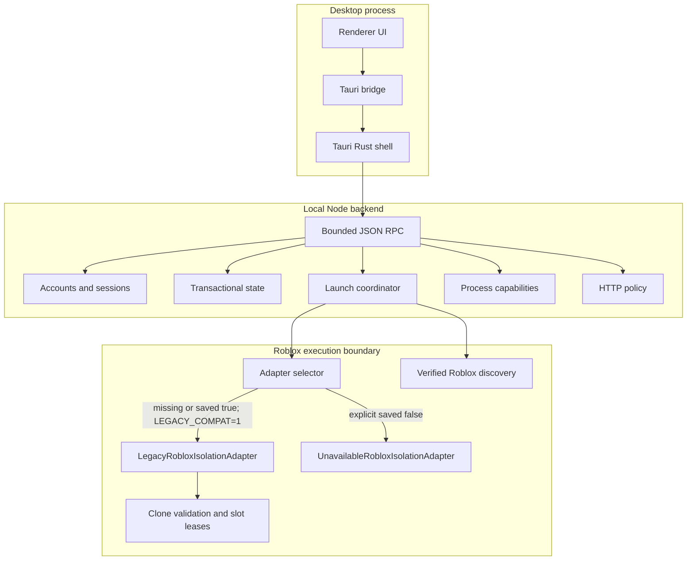

# Architecture

SUNDAY Launcher separates user interface, desktop ownership, backend policy,
process authority, persistence, isolation, and distribution. The separation is
intentional: UI state never grants native authority by itself.

## Renderer and native shell

`src/renderer` contains the HTML, CSS, view model, and minimal Tauri bridge. The
renderer sends named commands; it does not receive raw process handles or direct
filesystem authority.

The renderer never performs a browser clipboard read. An explicit
**Paste Roblox Link** gesture invokes a bounded Rust command that reads and
sanitizes `CF_UNICODETEXT` through Win32 before returning plain text to the
local parser. Startup, focus, navigation, and timers do not inspect clipboard
contents.

`src-tauri` owns the Windows desktop window, Tauri capabilities, single-instance
plugin, bundled Node resource, and communication with the backend. The
single-instance callback focuses the established owner instead of creating a
second state authority.

## Backend and state

`src/main/tauri-node-host.js` hosts the command surface implemented by
`tauri-backend.js`. Domain modules handle accounts, games, people, processes,
playtime, monitoring, and release trust.

Persistent stores use schema-versioned envelopes and durable replacement.
Malformed or incompatible state is quarantined instead of silently reset.
Transactional account operations use lock ownership and revisions to prevent a
stale asynchronous result from replacing newer state.

Runtime state belongs under the operating system's application-data directory
for `com.sadinkai.sundaylauncher`; it never belongs in the repository.

## Accounts and sessions

Account metadata and session material are separate concerns. New Roblox session
values are protected with Windows DPAPI for the current Windows user. The login
flow uses an origin-restricted, temporary WebView2 profile and purges it after
completion. Legacy base64 records are migration inputs, not an accepted storage
format for new sessions.

## Launch coordination

The launch coordinator creates durable plans, asks the selected isolation
adapter to prepare and launch, and records operation state. Keeper/rejoin logic
can request a relaunch only through this coordinator and only after a matching
owned exit. It is not a general process watcher or kill-all service.

`roblox.js` returns ranked verified installation candidates rather than trusting
a filename. Evidence can come from a validated manual override, registered
Roblox protocols, an observed running process path, bounded classic version
roots, or registered AppX/MSIX package and manifest metadata. Running processes
remain evidence only and are never adopted. Normal renderer status is sanitized
to installation type, display name, source, version, and compatibility state.

## Process capabilities

Observation and ownership are separate. An opaque process capability binds PID,
Windows creation identity, canonical image path, owner, account, instance, and
slot metadata. Focus, stop, and restart resolve that capability and revalidate
identity through a current native process handle. A PID alone is insufficient,
and an externally observed client is never adopted automatically.

## Isolation adapters

After persistent settings are loaded, `roblox-isolation-adapter.js` selects the
adapter before `LaunchCoordinator` is constructed:

- A missing first-run preference or saved `multiInstanceMode: true` selects
  `LegacyRobloxIsolationAdapter`; exact `LEGACY_COMPAT=1` remains a
  backward-compatible override.
- An explicit saved `multiInstanceMode: false` selects
  `UnavailableRobloxIsolationAdapter`, which permits launch planning but cannot
  execute Roblox.

The selected adapter is immutable for the process lifetime, so changing the
saved preference requires a controlled application restart. Diagnostics records
whether the saved setting or environment override selected it.

The legacy adapter retains the established singleton handling, clone builder,
tree validation, three-slot allocator, `RELEASED_BUT_BUSY` behavior, ownership
capabilities, cleanup, and restart rules. Generated clone paths are validated
before spawn, and no broad foreign-process cleanup is available.

Microsoft Store / AppX installations are discovered dynamically using Windows
package registration, manifest, application ID, and actual InstallLocation
metadata. The legacy clone adapter rejects them before allocation because
package contents are protected and were not qualified for this mechanism. No
WindowsApps ACL is changed and no package content is copied.

## Network boundary

Production backend requests use the centralized HTTP policy: HTTPS, hostname
allowlists, bounded redirects and bodies, expected media types, deadlines,
cancellation, and method-aware retry behavior. The renderer does not gain a
general-purpose remote navigation channel.

## Update and release trust

The release-trust code can validate signed canonical manifests with monotonic
sequence, publisher, key identifier, and artifact digests. The v1.8.17
assets are intentionally unsigned and are distributed with SHA-256 checksums.
The update coordinator cannot apply downloaded code merely because a public key
exists. In-application update application remains unavailable until
side-by-side activation, rollback, and the complete trust path are qualified.

## Installer

The standalone Rust installer embeds the verified portable payload. It requires
a dedicated empty non-reparse destination and enforces archive path, size,
ratio, duplicate, case-collision, reserved-name, and traversal bounds. The
ledger-bound uninstaller removes only unchanged owned files and preserves
unknown or modified content.

## Migration

Three isolated compatibility modules import supported state, renderer settings,
and installer ownership from the former product identity. They do not make the
former name a current alias. See [Migration](migration.md).

## Security boundaries

The principal boundaries are single-owner desktop authority, command schemas,
capability-bound native actions, origin-restricted login, centralized network
policy, durable state validation, exact adapter selection, clone validation,
ledger-bound uninstall, and fail-closed signing. These controls address specific
failure modes; they are not a guarantee that the host is uncompromised.
